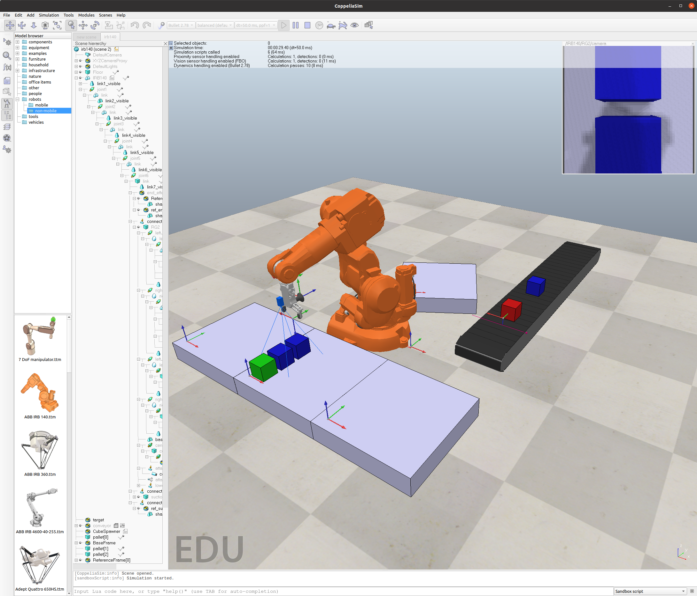

# README

**pyARTE** is a Python toolbox focussed on robotic manipulators.

The library uses Coppelia Sim as the main way to produce a representation of the robots and methods.

The main features of **pyARTE** are:

* Simulate some industrials robot within the Coppelia Sim environment.
* Path planning and obstacle avoidance.
* Practical exercises are provided.

Created by [Arturo Gil](http://arvc.umh.es/personal/arturo/index.php?lang=en&vista=normal&dest=inicio&idp=arturo&type=per&ficha=on): arturo.gil@umh.es. [Miguel Hernández University, Spain.](http://www.umh.es)

pyARTE is distributed under LGPL license.




# INSTALL

## DOWNLOAD THE CODE
Clone this repository:

```
>> git clone https://github.com/4rtur1t0/pyARTE.git
```

## DOWNLOAD AND INSTALL COPPELIA SIM
 
Download and extract CoppeliaSim on your PC. Download Coppelia from https://www.coppeliarobotics.com/downloads.
Download the EDU version of Coppelia, if pyARTE and Coppelia Sim are used for educational purposes.
pyARTE has been tested under Ubuntu 20.04 and 22.04. It has not been tested under Mac/Windows.


## INSTALL SYSTEM PACKAGES
Install python virtualenv
```
>> sudo  apt-get install virtualenv
```

Install python3-tk (needed in some distributions to plot with matplotlib).
```
>> sudo  apt-get install python3-tk
```

## CREATE A VIRTUAL ENVIRONMENT
We will be creating a virtualn environment at your user's home/Applications directory: 
```
>> cd
>> mkdir Applications
>> cd Applications
>> virtualenv venv
```

Next, install some needed python packages. We only require matplotlib, numpy and pynput:
```
>> cd /home/user/Applications/venv/bin
>> ./pip3 install numpy matplotlib pynput pyzmq cbor opencv-python
```

## CONFIGURE YOUR IDE

Open the project in Pycharm (or any other python editor). Use the option ''add root content'' in 
File-Settings-Project Structure-- Add Content Root. Under the root content (the files that will be included in the python
execution), you should include:
- Add the directory with the zmQ communications library that is included with Coppelia Sim. Generally, the remote zmq Api can be found in:
  /home/user/Applications/CoppeliaSim_Edu_V4_5_1_rev4_Ubuntu22_04/programming/zmqRemoteApi/clients/python/src
- Check that the directory pyARTE is also included.

Alternatively, the directory path with the Zmq libraries can also be added to the PYTHONPATH variable:
$ export PYTHONPATH=/home/usuario/Applications/CoppeliaSim_Edu_V4_5_1_rev4_Ubuntu22_04/programming/zmqRemoteApi/clients/python/src


## TEST
Open Coppelia Sim
Open the irb140.ttt scene
Open and execute the pyARTE/practicals/irb140_first_script.py
Open and execute the pyARTE/practicals/applications/irb140_palletizing_color.py

The python scripts should connect to Coppelia and start the simulation.

##SCENES
The directory pyARTE/scenes includes a set of scenes that should be opened in Coppelia Sim in order to execute the demos or tutorials in this library.


